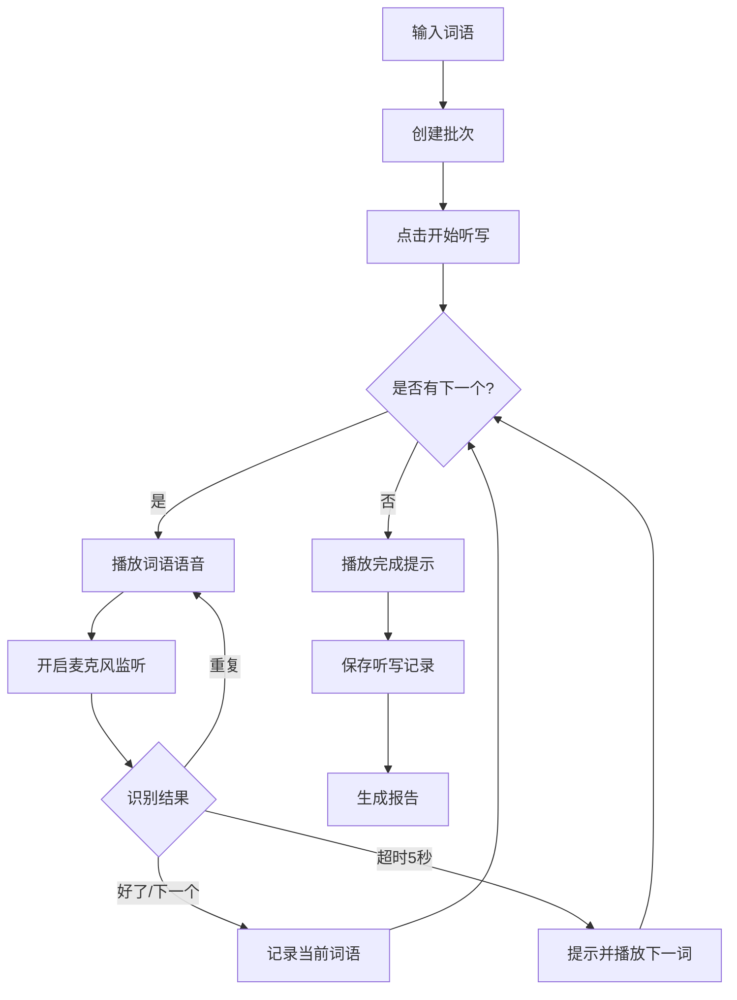

# 小学生听写助手 Web应用 - 产品需求文档 (PRD)

## 1. 产品概述

### 1.1 产品定位
一款专为小学生设计的智能听写辅助Web应用，通过语音交互帮助学生完成词语听写练习，记录学习数据，生成学习报告，提高学习效率。

### 1.2 目标用户
- 小学生（主要用户）
- 家长（辅导监督）
- 教师（布置听写任务）

### 1.3 核心价值
- 解放家长：自动语音播报，无需家长逐个读词
- 科学记录：完整记录听写历史，分析薄弱环节
- 个性化学习：根据历史数据生成生词本和听写建议

## 2. 功能需求

### 2.1 核心功能

#### 2.1.1 词语录入
- **输入方式**：支持空格分隔的多个词语输入
- **批次管理**：每次录入为一个独立批次，自动记录录入时间
- **词语状态**：
  - 待听写（未开始）
  - 听写中（当前播放）
  - 已完成（已听写）

#### 2.1.2 预设内容导入（新增）
- **功能描述**：提供一键导入预设听写内容，方便快速试听
- **预设内容**：
  - 小学最常用50个单词（水果、文具、自然等）
  - 小学最常用50个成语（一XXX格式的成语）
  - 小学最常用20首古诗（静夜思、春晓等）
  - 小学最常用5篇古文（弟子规、三字经等）
- **导入流程**：
  - 点击对应预设按钮 → 自动填充词语 → 创建听写批次
- **数据存储**：预设内容以JSON格式存储于resources/preset-content目录

#### 2.1.2 语音听写流程
```
开始听写 → 播放词语(语音) → 停顿 → 开启麦克风监听
    ↓
监听结果判断：
  ├─ 识别到"好了/下一个" → 播放下一个词语
  ├─ 超时5秒无响应 → 提示"下一个听写词语：**"并播放
  └─ 所有词语完成 → 播放"所有听写均已完成"
```

#### 2.1.3 Web界面控制
- **实时统计面板**：
  - 当前听写词语显示
  - 本次已听写数量
  - 剩余未听写数量
  
- **控制按钮**：
  - 「再次读取」：重复播放当前词语
  - 「上一个」：返回上一个词语
  - 「下一个」：跳到下一个词语
  - 「开始听写」：启动听写流程
  - 「暂停」：暂停当前听写

#### 2.1.4 语音识别与交互
- **语音播报**：使用Web Speech API (SpeechSynthesis)
- **语音识别**：使用Web Speech API (SpeechRecognition)
- **关键词检测**：
  - "好了" / "下一个" / "下一题" → 下一词
  - "重复" / "再说一遍" → 重新播放
  - "上一个" / "上一题" → 返回上一词

### 2.2 数据管理功能

#### 2.2.1 数据库设计
```sql
-- 批次表
CREATE TABLE dictation_batch (
    id BIGINT PRIMARY KEY AUTO_INCREMENT,
    batch_name VARCHAR(100),
    created_at TIMESTAMP,
    total_words INT,
    completed_words INT,
    status VARCHAR(20) -- DRAFT, IN_PROGRESS, COMPLETED
);

-- 词语表
CREATE TABLE word (
    id BIGINT PRIMARY KEY AUTO_INCREMENT,
    word_text VARCHAR(50) NOT NULL,
    pinyin VARCHAR(100),
    batch_id BIGINT,
    sort_order INT,
    status VARCHAR(20), -- PENDING, CURRENT, COMPLETED
    created_at TIMESTAMP
);

-- 听写记录表
CREATE TABLE dictation_record (
    id BIGINT PRIMARY KEY AUTO_INCREMENT,
    word_id BIGINT,
    batch_id BIGINT,
    start_time TIMESTAMP,
    end_time TIMESTAMP,
    duration_seconds INT,
    repeat_count INT DEFAULT 0, -- 重复播放次数
    status VARCHAR(20) -- SUCCESS, SKIPPED
);

-- 生词本表
CREATE TABLE difficult_word (
    id BIGINT PRIMARY KEY AUTO_INCREMENT,
    word_id BIGINT,
    error_count INT DEFAULT 0,
    avg_duration_seconds INT,
    last_practice_date DATE,
    mastery_level INT -- 1-5, 5为完全掌握
);

-- 听写建议表
CREATE TABLE suggestion (
    id BIGINT PRIMARY KEY AUTO_INCREMENT,
    word_id BIGINT,
    suggestion_type VARCHAR(50), -- WEAK_WORD, NEW_WORD, REVIEW
    priority INT,
    created_at TIMESTAMP
);
```

#### 2.2.2 历史记录
- 保留所有批次听写历史
- 支持按日期、批次筛选查看
- 单个词语耗时记录
- 批次总耗时统计

### 2.3 报表与分析功能

#### 2.3.1 听写报表
- **日报表**：当日听写词语数、平均耗时、完成率
- **周报表**：本周累计听写、易错词语Top10
- **月报表**：月度听写趋势、进步曲线

#### 2.3.2 生词本
- 自动识别"困难词语"（重复播放次数多/耗时长的词语）
- 支持手动添加生词
- 生词优先级排序

#### 2.3.3 智能建议
- 基于历史数据推荐复习词语
- 识别薄弱环节，生成针对性练习建议
- 学习路径优化建议

## 3. 非功能需求

### 3.1 技术架构
```
┌─────────────────────────────────────────────────────────────────┐
│                     Spring Boot 单体应用                        │
│  ┌──────────────────────────────────────────────────────────┐  │
│  │                    Thymeleaf 模板层                       │  │
│  │  ┌─────────────┐  ┌─────────────┐  ┌─────────────┐      │  │
│  │  │  HTML页面   │  │  Web Speech │  │   原生JS    │      │  │
│  │  │  (Thymeleaf)│  │     API     │  │   交互逻辑  │      │  │
│  │  └─────────────┘  └─────────────┘  └─────────────┘      │  │
│  └──────────────────────────────────────────────────────────┘  │
│                              │                                  │
│  ┌──────────────────────────────────────────────────────────┐  │
│  │                    Controller 层                          │  │
│  │  ┌─────────────────┐  ┌─────────────────────────────┐   │  │
│  │  │  PageController │  │    REST API Controllers     │   │  │
│  │  │   (页面路由)    │  │  (Batch/Word/Record/...)   │   │  │
│  │  └─────────────────┘  └─────────────────────────────┘   │  │
│  └──────────────────────────────────────────────────────────┘  │
│                              │                                  │
│  ┌──────────────────────────────────────────────────────────┐  │
│  │                    Service 业务层                         │  │
│  └──────────────────────────────────────────────────────────┘  │
│                              │                                  │
│  ┌──────────────────────────────────────────────────────────┐  │
│  │                  Repository 数据层                        │  │
│  │  ┌─────────────────────────────────────────────────┐     │  │
│  │  │        Spring Data JPA (Hibernate)             │     │  │
│  │  └─────────────────────────────────────────────────┘     │  │
│  └──────────────────────────────────────────────────────────┘  │
│                              │                                  │
│  ┌──────────────────────────────────────────────────────────┐  │
│  │                   SQLite Database                        │  │
│  └──────────────────────────────────────────────────────────┘  │
└─────────────────────────────────────────────────────────────────┘

单体架构优势：
  - 简化部署：一个应用包含所有功能，一次启动即可运行
  - 统一管理：前后端代码在同一项目中，便于维护
  - 减少复杂度：无需前后端分离的额外配置和依赖
  - 开发效率高：Thymeleaf模板热更新，快速迭代
```

### 3.2 技术栈要求
- **后端**：Spring Boot 4.0.5 (最新稳定版)
- **JDK**：JDK 21
- **模板引擎**：Thymeleaf 3.1
- **前端交互**：原生 JavaScript (ES6+)
- **数据库**：SQLite 3
- **构建工具**：Maven
- **语音API**：Web Speech API (浏览器原生支持)
- **JSON处理**：Jackson 3.1 (tools.jackson)

### 3.3 单体架构设计说明

本项目采用Spring Boot + Thymeleaf单体架构，具有以下特点：

#### 架构优势
1. **简化部署**
   - 一个jar包包含所有功能
   - 无需单独部署前端服务
   - 启动命令即可运行

2. **统一启动**
   - 只需启动Spring Boot应用
   - Thymeleaf模板自动渲染
   - 静态资源由Spring Boot提供

3. **开发便利**
   - 前后端代码在同一项目
   - 模板支持热更新
   - 调试更加简单

#### Thymeleaf模板使用
- 页面模板位于 `src/main/resources/templates/`
- 静态资源位于 `src/main/resources/static/`
- 使用Thymeleaf语法进行服务端渲染
- 支持布局复用和片段包含

#### 原生JavaScript实现
- 语音交互使用Web Speech API
- DOM操作使用原生JavaScript
- HTTP请求使用Fetch API
- 无需前端框架依赖

### 3.4 性能要求
- 页面加载时间 < 2秒
- 语音播放延迟 < 500ms
- 数据库查询响应 < 100ms

### 3.5 兼容性
- 支持Chrome、Edge、Safari最新版本
- 移动端响应式适配
- 支持语音识别的主流浏览器

## 4. 用户界面设计

### 4.1 页面结构

#### 主页面布局
```
┌────────────────────────────────────────────────┐
│  听写助手 - 小学生词语听写练习                    │
├────────────────────────────────────────────────┤
│  ┌──────────────────────────────────────────┐  │
│  │  统计面板                                  │  │
│  │  当前听写：苹果  │ 已听写：3个  │ 剩余：7个 │  │
│  └──────────────────────────────────────────┘  │
│                                                │
│  ┌──────────────────────────────────────────┐  │
│  │  词语显示区                                │  │
│  │         [ 苹果 ]                          │  │
│  │      点击按钮开始听写                      │  │
│  └──────────────────────────────────────────┘  │
│                                                │
│  ┌──────────────────────────────────────────┐  │
│  │  控制按钮区                                │  │
│  │  [再次读取] [上一个] [下一个] [开始听写]   │  │
│  └──────────────────────────────────────────┘  │
│                                                │
│  ┌──────────────────────────────────────────┐  │
│  │  词语录入区                                │  │
│  │  [输入词语...]              [添加批次]     │  │
│  └──────────────────────────────────────────┘  │
└────────────────────────────────────────────────┘
```

#### 历史记录页面
```
┌────────────────────────────────────────────────┐
│  历史记录                                       │
├────────────────────────────────────────────────┤
│  筛选：[日期范围] [批次] [状态]                 │
│                                                │
│  ┌────────────────────────────────────────┐   │
│  │ 批次1 - 2024-01-15                      │   │
│  │ 词语：苹果 香蕉 橘子...                  │   │
│  │ 完成：10/15  耗时：5分30秒               │   │
│  │ [查看详情]                               │   │
│  └────────────────────────────────────────┘   │
└────────────────────────────────────────────────┘
```

#### 生词本页面
```
┌────────────────────────────────────────────────┐
│  我的生词本                                     │
├────────────────────────────────────────────────┤
│  ┌──────┬────────┬────────┬────────┐         │
│  │ 词语 │ 错误次数│ 平均耗时│ 掌握度  │         │
│  ├──────┼────────┼────────┼────────┤         │
│  │ 葡萄 │   3    │  8.5秒 │  ★★☆☆☆ │         │
│  │ 西瓜 │   2    │  6.2秒 │  ★★★☆☆ │         │
│  └──────┴────────┴────────┴────────┘         │
│                                                │
│  [导出生词本] [针对性练习]                       │
└────────────────────────────────────────────────┘
```

### 4.2 交互流程

#### 听写流程图


## 5. API设计

### 5.1 RESTful API

#### 批次管理
```
POST   /api/batches              - 创建新批次
GET    /api/batches              - 获取批次列表
GET    /api/batches/{id}         - 获取批次详情
DELETE /api/batches/{id}         - 删除批次
```

#### 词语管理
```
POST   /api/words                - 添加词语到批次
GET    /api/words/batch/{id}     - 获取批次词语列表
PUT    /api/words/{id}/status    - 更新词语状态
```

#### 听写操作
```
POST   /api/dictation/start/{batchId}  - 开始听写
POST   /api/dictation/next              - 下一个词语
POST   /api/dictation/previous         - 上一个词语
POST   /api/dictation/repeat           - 重复播放
POST   /api/dictation/complete/{wordId} - 完成词语听写
POST   /api/dictation/end/{batchId}    - 结束听写
```

#### 报表统计
```
GET    /api/reports/daily         - 日报表
GET    /api/reports/weekly        - 周报表
GET    /api/reports/monthly       - 月报表
GET    /api/difficult-words       - 获取生词本
POST   /api/difficult-words       - 添加生词
DELETE /api/difficult-words/{id}  - 移除生词
GET    /api/suggestions           - 获取听写建议
```

## 6. 项目规划

### 6.1 开发阶段

#### Phase 1: 基础框架 (第1天)
- Spring Boot项目搭建
- SQLite数据库集成
- 基础实体类和Repository
- Thymeleaf模板配置

#### Phase 2: 核心功能 (第2-3天)
- 批次和词语管理API
- 听写流程控制API
- Thymeleaf页面模板开发
- 原生JavaScript交互实现

#### Phase 3: 语音交互 (第4-5天)
- Web Speech API集成
- 语音播报功能
- 语音识别监听
- 前端交互优化

#### Phase 4: 数据统计 (第6-7天)
- 听写记录存储
- 报表生成功能
- 生词本功能
- Chart.js图表集成

#### Phase 5: 优化完善 (第8天)
- UI美化
- 性能优化
- 测试与调试

### 6.2 技术要点

#### Spring Boot配置
```java
// 使用Spring Boot 3.2.x
// JDK 21特性：Virtual Threads, Pattern Matching
// SQLite集成：使用sqlite-jdbc驱动
// Thymeleaf模板引擎配置

@Configuration
public class SQLiteConfig {
    @Bean
    public DataSource dataSource() {
        return new SQLiteDataSource("jdbc:sqlite:dictation.db");
    }
}
```

#### Thymeleaf模板示例
```html
<!DOCTYPE html>
<html xmlns:th="http://www.thymeleaf.org">
<head>
    <title>听写助手</title>
</head>
<body>
    <div th:text="${currentWord}">词语显示区</div>
    <button onclick="speakWord()">开始听写</button>
    <script th:src="@{/js/app.js}"></script>
</body>
</html>
```

#### Web Speech API
```javascript
// 语音播报
const utterance = new SpeechSynthesisUtterance(word);
speechSynthesis.speak(utterance);

// 语音识别
const recognition = new webkitSpeechRecognition();
recognition.continuous = true;
recognition.onresult = (event) => {
    const result = event.results[0][0].transcript;
    // 处理识别结果
};
```

### 6.3 单体架构开发流程

```
┌─────────────────────────────────────────────────────────────┐
│                     开发工作流程                             │
├─────────────────────────────────────────────────────────────┤
│  1. 启动应用: mvn spring-boot:run                           │
│  2. 访问页面: http://localhost:8080                         │
│  3. 修改模板: templates/*.html (热更新生效)                  │
│  4. 修改静态资源: static/js/*.js, static/css/*.css          │
│  5. 修改后端代码: 重新编译后自动重启                        │
│  6. 打包部署: mvn clean package                            │
└─────────────────────────────────────────────────────────────┘
```

## 7. 测试计划

### 7.1 功能测试
- 词语录入与解析
- 语音播报准确性
- 语音识别准确性
- 数据持久化
- 报表生成

### 7.2 兼容性测试
- Chrome浏览器测试
- Edge浏览器测试
- Safari浏览器测试
- 移动端测试

### 7.3 性能测试
- 大量词语加载性能
- 语音响应延迟
- 数据库查询性能

## 8. 风险与对策

### 8.1 技术风险
| 风险 | 影响 | 对策 |
|------|------|------|
| 浏览器语音API兼容性 | 高 | 提供备用文本模式，提示用户使用兼容浏览器 |
| SQLite并发写入限制 | 中 | 使用WAL模式，控制并发 |
| 网络延迟影响体验 | 中 | 本地缓存，离线功能支持 |

### 8.2 用户体验风险
| 风险 | 影响 | 对策 |
|------|------|------|
| 语音识别不准确 | 高 | 提供手动控制按钮，识别结果置信度过滤 |
| 儿童操作困难 | 中 | 简化界面，大按钮设计，语音引导 |

## 9. 版本规划

### v1.0 (MVP)
- 基础听写功能
- 语音播报和识别
- 简单历史记录

### v1.1
- 生词本功能
- 基础报表

### v1.2
- 听写建议
- 学习路径优化
- 家长监督模式

### v2.0
- 多用户支持
- 云端同步
- 教师管理后台

## 10. 参考资料

### 10.1 竞品分析
- **一起作业**：功能全面，但需注册账号
- **作业帮听写**：语音识别准确，但无学习报告
- **小猿听写**：界面友好，但个性化不足

### 10.2 技术文档
- [Spring Boot官方文档](https://spring.io/projects/spring-boot)
- [Web Speech API MDN](https://developer.mozilla.org/en-US/docs/Web/API/Web_Speech_API)
- [SQLite文档](https://www.sqlite.org/docs.html)

---

**文档版本**：v1.1
**创建日期**：2026-04-06
**最后更新**：2026-04-12